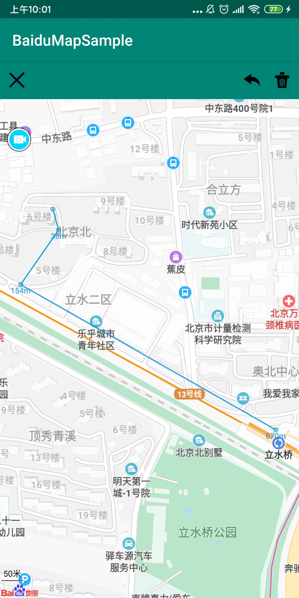
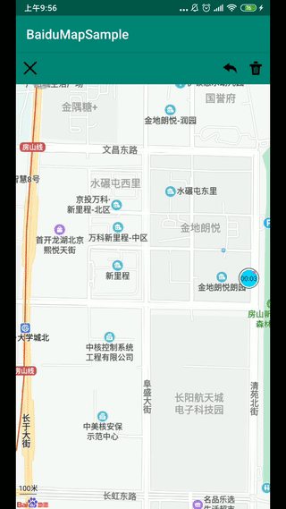

# BaiduMapSample

百度地图技术调研与储备

## 一、地图测距

#### GIF

技术储备之地图测距

购房首要因素之一查询配套离自己小区离自己所处的楼栋多远:

- 场景一: 楼栋到地铁的距离
- 场景二: 楼栋到学校的距离
- 场景三: 咨询师、经纪人给客户介绍本案的时候，让客户自己操作得出来的距离远比听解说介绍来得更有认同感

Depend:

app/libs/BaiduLBS_Android.jar

app/libs/armeabi/libBaiduMapSDK_base_v6_1_0.so

app/libs/armeabi/libBaiduMapSDK_map_v6_1_0.so

//TODO 点击地铁图标无效